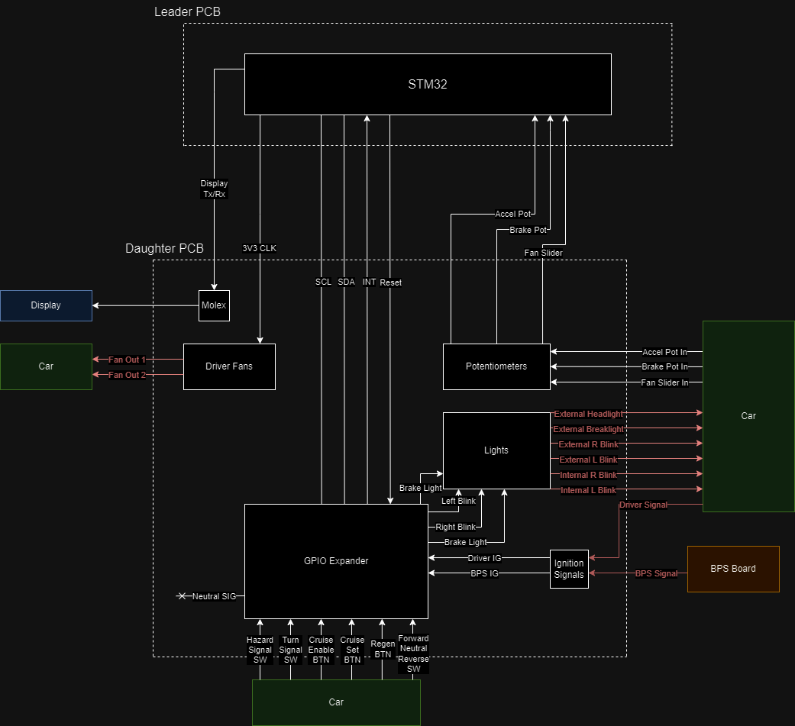

# Controls-DaughterPCB
Author: Jack Guarnery and Zoe Gonzalez

This board uses the boot-hat leader-daughter system. It takes inputs from the car to control lights, fans, the display, and other functions on the car. The board shares 3V3, 5V, 12V, 3V3 & 5V GND, 12V GND, and analog ground with the leader SOM.

## Features
- A 555 CMOS timer running off 3V3 was used for the car's blinkers. A CMOS timer was used instead of the standard 555 timer or GPIO to allow for 3V3, reduce power draw, and reduce GPIO connections out of the board to the leader SOM. The CMOS 555 timer uses a system of two resistors and a capacitor to generate a duty cycle (see schematic for equation).
- Debouncing circuitry is employed in all external switches and buttons to smooth out button & switch noise when pressed.
- Optocouplers isolate the connectors requiring 12V, such as lights, fans, and the ignition signals, from the 3V3 and 5V components with a different ground. The optocouplers work by emitting light in the form of an LED to activate MOSFETs.
- Three potentiometer connectors are included with over & under-voltage protection, noise reduction circuitry, and pull-up & pull-down resistors to ensure if the potentiometer becomes disconnected, the signal will be set to low or high to ensure the safety of the driver and car. The potentiometers used are for accelerating, braking, and driver fan speed.
- The driver fans are controlled by a slider potentiometer which sends an analog signal to the MCU, which will output a PWM signal based on the value of the analog input. The PWM signal will be routed to an optocoupler which connects to the two fans.
- All lights except the headlights use an optocoupler to isolate the control signal from the light. Headlights always remain on.
- Two inputs from BPS and the driver ignition switch fed to optocouplers to send a signal to the MCU about the car's ignition state.
- Connections routed from the leader through the daughter board include the Display power and data connections and Motor CAN power connections.

## Data Path Diagram

## ReadMe TODO
- Add connectors, inputs, and outputs tables.
- Add image(s) of 3D schematic.
- Add Mauser cart.
- Add any additional layout info once the layout is complete.
